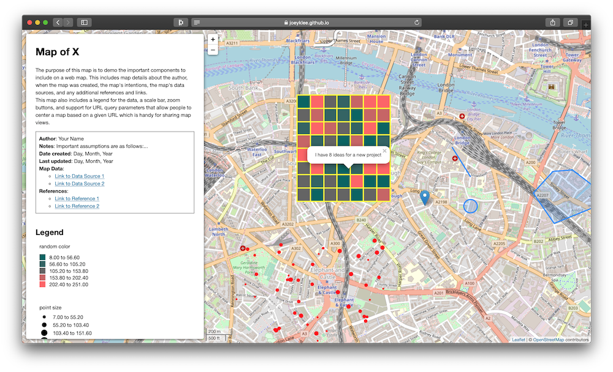

# leafletjs starter
> An (opinionated) template for building leafletjs applications. Prepared for [All Maps Lie 2020](https://all-maps-lie-2020.netlify.com/#/).

## About

The purpose of this map is to demo the important components to include on a  web map. This includes:
*  map details about the author, 
*  when the map was created, 
*  the map's intentions, 
*  the map's data sources, and 
*  any additional references and links.

This map also includes basic support for: 
* the creation of a legend for map data, 
* a scale bar, 
* zoom buttons, and 
* support for URL query parameters that allow people to center a map based on a given URL which is handy for sharing map views.

## Audience 
This template is designed for students who are just getting started with leaflet and web mapping. The idea is to provide as much boilerplate setup as possible so people can focus on the mapping concepts and map data.

## TODOS

* add categorical legend scale support -- right now it is only numeric
* create a mini library from this?
  * maybe worth creating a mini plugin for the query URL parameters?

## `Map` class
The `Map.js` class is a thin wrapper layer to hide some of the inner workings of leaflet, the d3-legend library, and the other "map setup stuff" mentioned above. If you look in there, you can see how the methods and mappy stuff are handled.

## Built with:
* leaflet.js
  * leaflet-sidebar
* turf.js
* d3
  * d3-legend

## Authors
* [@joeyklee](https://github.com/joeyklee)
